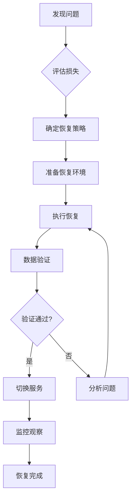

# 数据备份策略

## 概述

本文档定义了耶氏台球报价系统的数据备份和恢复策略，确保数据安全性和业务连续性。

## 1. 备份策略概览

### 1.1 备份类型

1. **全量备份** (Full Backup)
   - 频率：每周日凌晨 2:00
   - 保留期：30天
   - 内容：完整数据库 + 文件存储

2. **增量备份** (Incremental Backup)
   - 频率：每日凌晨 3:00
   - 保留期：7天
   - 内容：自上次备份以来的变更

3. **事务日志备份** (WAL Archive)
   - 频率：持续（每5分钟）
   - 保留期：24小时
   - 内容：事务日志文件

4. **关键数据实时备份**
   - 频率：实时
   - 目标：异地数据中心
   - 内容：quotes、customers、products表

### 1.2 备份存储位置

```
主备份存储：
├── Supabase 自动备份（内置）
├── 云存储备份（阿里云 OSS）
│   ├── /daily/          # 每日增量备份
│   ├── /weekly/         # 每周全量备份
│   └── /monthly/        # 每月归档
└── 本地备份服务器
    └── /backup/postgres/
```

## 2. Supabase 内置备份

### 2.1 Point-in-Time Recovery (PITR)

Supabase Pro 计划提供 PITR 功能：
- 可恢复到过去 7 天内的任意时间点
- 自动管理，无需手动配置
- 通过 Supabase 控制台操作

### 2.2 每日自动备份

- Supabase 自动执行每日备份
- 保留最近 7 天的备份
- 可通过控制台下载或恢复

## 3. 自定义备份脚本

### 3.1 环境变量配置

创建 `.env.backup` 文件：

```env
# 数据库连接
POSTGRES_HOST=db.xxxxx.supabase.co
POSTGRES_PORT=5432
POSTGRES_DB=postgres
POSTGRES_USER=postgres
POSTGRES_PASSWORD=your_password

# 备份配置
BACKUP_DIR=/backup/postgres
BACKUP_RETENTION_DAYS=30
BACKUP_COMPRESSION=gzip

# 云存储配置（阿里云OSS）
OSS_ENDPOINT=oss-cn-hangzhou.aliyuncs.com
OSS_BUCKET=yessales-backup
OSS_ACCESS_KEY_ID=your_access_key
OSS_ACCESS_KEY_SECRET=your_secret_key

# 通知配置
NOTIFICATION_WEBHOOK=https://dingtalk.com/webhook/xxx
NOTIFICATION_EMAIL=admin@yessales.com
```

### 3.2 备份通知模板

```json
{
  "backup_status": {
    "success": {
      "title": "✅ 数据备份成功",
      "message": "备份任务 {task_id} 已成功完成\n- 类型: {backup_type}\n- 大小: {backup_size}\n- 耗时: {duration}\n- 位置: {backup_location}"
    },
    "failed": {
      "title": "❌ 数据备份失败", 
      "message": "备份任务 {task_id} 执行失败\n- 类型: {backup_type}\n- 错误: {error_message}\n- 时间: {timestamp}"
    }
  }
}
```

## 4. 备份计划

### 4.1 每日备份计划

| 时间 | 任务 | 类型 | 目标 |
|------|------|------|------|
| 00:00 | 业务数据导出 | 增量 | CSV文件 |
| 01:00 | 文件存储同步 | 增量 | OSS |
| 03:00 | 数据库备份 | 增量 | 本地+OSS |
| 06:00 | 备份验证 | 检查 | - |

### 4.2 每周备份计划

| 星期 | 任务 | 类型 | 保留期 |
|------|------|------|--------|
| 周日 | 全量数据库备份 | 全量 | 30天 |
| 周三 | 中期增量备份 | 增量 | 7天 |
| 周五 | 文件存储全量备份 | 全量 | 14天 |

### 4.3 每月备份计划

- 每月1日：创建月度归档备份，永久保留
- 每月15日：清理过期备份文件
- 每月最后一天：备份策略审查

## 5. 备份内容详情

### 5.1 数据库备份内容

```sql
-- 核心业务表（优先级：高）
- customers        # 客户信息
- products        # 产品信息
- product_skus    # 产品规格
- accessories     # 配件信息
- quotes          # 报价单
- quote_items     # 报价明细
- users           # 用户信息
- operation_logs  # 操作日志

-- 系统配置表（优先级：中）
- 系统参数
- 权限配置
- 邮件模板

-- 统计数据表（优先级：低）
- 访问日志
- 性能指标
```

### 5.2 文件存储备份

```
/storage/
├── products/      # 产品图片
├── quotes/        # 报价单附件
├── customers/     # 客户资料
└── exports/       # 导出文件
```

## 6. 恢复策略

### 6.1 恢复时间目标 (RTO)

- **关键业务数据**：< 1小时
- **完整数据库**：< 4小时
- **文件存储**：< 6小时
- **完整系统**：< 8小时

### 6.2 恢复点目标 (RPO)

- **交易数据**：< 5分钟
- **配置数据**：< 1小时
- **文件数据**：< 24小时

### 6.3 恢复优先级

1. **P0 - 立即恢复**
   - 用户认证服务
   - 报价单核心功能
   - 客户数据

2. **P1 - 1小时内**
   - 产品目录
   - 价格计算
   - 图片服务

3. **P2 - 4小时内**
   - 历史数据
   - 统计报表
   - 日志记录

## 7. 备份验证

### 7.1 自动验证

每日自动执行：
1. 备份文件完整性检查
2. 恢复测试（恢复到测试环境）
3. 数据一致性校验
4. 备份大小和时间检查

### 7.2 人工验证

每月执行：
1. 完整恢复演练
2. 跨区域恢复测试
3. 备份策略评审
4. 恢复文档更新

## 8. 灾难恢复计划

### 8.1 灾难场景

1. **数据损坏**：使用最近的备份恢复
2. **误删除**：从备份或 PITR 恢复
3. **服务器故障**：切换到备用服务器
4. **区域性灾难**：从异地备份恢复

### 8.2 恢复流程



## 9. 备份监控和告警

### 9.1 监控指标

- 备份成功率
- 备份文件大小
- 备份执行时间
- 存储空间使用率
- 恢复测试成功率

### 9.2 告警规则

| 告警级别 | 条件 | 通知方式 |
|---------|------|---------|
| 严重 | 备份失败 | 电话 + 短信 + 邮件 |
| 高 | 备份延迟 > 2小时 | 钉钉 + 邮件 |
| 中 | 存储空间 < 20% | 邮件 |
| 低 | 备份文件异常 | 日志记录 |

## 10. 合规性和安全

### 10.1 数据加密

- 传输加密：TLS 1.2+
- 存储加密：AES-256
- 密钥管理：定期轮换

### 10.2 访问控制

- 备份文件访问需要MFA认证
- 最小权限原则
- 访问日志审计

### 10.3 合规要求

- 符合《数据安全法》要求
- 满足行业标准
- 定期安全审计

## 11. 成本优化

### 11.1 存储分级

- 热备份（0-7天）：标准存储
- 温备份（7-30天）：低频访问存储
- 冷备份（>30天）：归档存储

### 11.2 成本控制

- 使用增量备份减少存储
- 压缩备份文件
- 定期清理过期备份
- 使用生命周期策略

## 12. 备份检查清单

### 每日检查
- [ ] 备份任务执行状态
- [ ] 备份文件完整性
- [ ] 存储空间充足
- [ ] 无异常告警

### 每周检查
- [ ] 恢复测试通过
- [ ] 备份性能正常
- [ ] 清理过期备份
- [ ] 更新备份文档

### 每月检查
- [ ] 完整恢复演练
- [ ] 备份策略评审
- [ ] 成本分析
- [ ] 安全审计

---

**重要提示**：
1. 所有备份操作必须记录在操作日志中
2. 恢复操作需要至少两人审核
3. 定期（每季度）更新此文档
4. 紧急联系人名单需保持最新