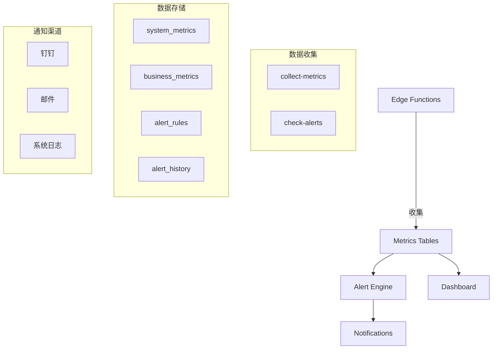

# YesSales 监控系统文档

## 概述

YesSales 监控系统提供了全面的系统性能监控、业务指标跟踪和智能告警功能，帮助团队及时发现和解决问题。

## 系统架构



## 核心功能

### 1. 指标收集

系统自动收集两类指标：

#### 系统指标
- **数据库性能**: 连接数、查询性能、表大小
- **API性能**: 响应时间、错误率、请求量
- **存储使用**: 空间占用、文件数量
- **系统资源**: CPU、内存使用率

#### 业务指标
- **销售数据**: 日报价单数、成交率、客户增长
- **用户活跃度**: 活跃用户数、登录频率
- **库存状态**: 产品数量、库存预警

### 2. 告警系统

#### 告警级别
- **Critical (严重)**: 需要立即处理的问题
- **Warning (警告)**: 需要关注但不紧急的问题
- **Info (信息)**: 一般性通知

#### 默认告警规则

| 规则名称 | 条件 | 阈值 | 级别 | 通知方式 |
|---------|------|------|------|---------|
| 高错误率告警 | 错误率 > 5% | 5% | Critical | 钉钉、邮件 |
| API响应时间告警 | 响应时间 > 2秒 | 2000ms | Warning | 钉钉 |
| 存储空间告警 | 使用率 > 90% | 90% | Critical | 钉钉、邮件 |
| 数据库连接数告警 | 连接数 > 90 | 90 | Warning | 钉钉 |
| 备份失败告警 | 备份成功 = 0 | 0 | Critical | 钉钉、邮件 |

### 3. 监控仪表板

提供多个预配置的仪表板视图：

- **系统概览**: 整体健康状态、关键指标
- **性能监控**: API响应时间、数据库性能
- **业务分析**: 销售趋势、用户行为
- **告警中心**: 当前告警、历史记录

## 部署指南

### 1. 数据库初始化

执行以下 SQL 文件：
```bash
# 创建监控表结构
psql -f supabase/migrations/20250108_monitoring_tables.sql

# 创建辅助函数
psql -f supabase/migrations/20250108_monitoring_functions.sql
```

### 2. 部署 Edge Functions

```bash
# 部署指标收集函数
supabase functions deploy collect-metrics

# 部署告警检查函数
supabase functions deploy check-alerts
```

### 3. 配置环境变量

在 Supabase Dashboard 中设置：
```env
# 钉钉机器人 Webhook
DINGTALK_WEBHOOK_URL=https://oapi.dingtalk.com/robot/send?access_token=xxx

# 邮件服务配置（可选）
SENDGRID_API_KEY=xxx
ALERT_EMAIL_FROM=alerts@yessales.com
ALERT_EMAIL_TO=admin@yessales.com
```

### 4. 配置定时任务

参考 [定时任务配置文档](./cron-jobs.md)

## 使用指南

### 查看监控数据

```sql
-- 查看最新系统指标
SELECT * FROM system_metrics 
ORDER BY recorded_at DESC 
LIMIT 20;

-- 查看今日业务指标
SELECT * FROM business_metrics 
WHERE DATE(recorded_at) = CURRENT_DATE
ORDER BY recorded_at DESC;

-- 获取指标汇总
SELECT * FROM get_metrics_summary('system', 'api_response_time', '24 hours');

-- 获取时间序列数据
SELECT * FROM get_metrics_timeseries('business', 'daily_quotes', '7 days', '1 day');
```

### 管理告警规则

```sql
-- 添加新告警规则
INSERT INTO alert_rules (
  rule_name, 
  rule_type, 
  metric_source, 
  metric_name, 
  condition, 
  threshold, 
  severity, 
  notification_channels
) VALUES (
  '低销售告警',
  'threshold',
  'business',
  'daily_quotes',
  '<',
  5,
  'warning',
  '["dingtalk"]'
);

-- 禁用告警规则
UPDATE alert_rules 
SET is_active = false 
WHERE rule_name = '低销售告警';

-- 查看当前告警
SELECT 
  ah.*,
  ar.rule_name,
  ar.severity
FROM alert_history ah
JOIN alert_rules ar ON ah.rule_id = ar.id
WHERE ah.alert_status = 'triggered'
ORDER BY ah.triggered_at DESC;
```

### 确认告警

```sql
-- 确认告警
UPDATE alert_history
SET 
  alert_status = 'acknowledged',
  acknowledged_at = NOW(),
  acknowledged_by = auth.uid()
WHERE id = 'alert-id';
```

## API 接口

### 手动触发指标收集

```bash
curl -X POST https://[PROJECT_REF].supabase.co/functions/v1/collect-metrics \
  -H "Authorization: Bearer [ANON_KEY]" \
  -H "Content-Type: application/json"
```

### 手动检查告警

```bash
curl -X POST https://[PROJECT_REF].supabase.co/functions/v1/check-alerts \
  -H "Authorization: Bearer [ANON_KEY]" \
  -H "Content-Type: application/json"
```

## 最佳实践

### 1. 指标设计
- 选择有业务意义的指标
- 避免收集过多无用数据
- 设置合理的采集频率

### 2. 告警配置
- 设置合理的阈值，避免告警疲劳
- 使用分级告警，区分紧急程度
- 定期回顾和调整告警规则

### 3. 性能优化
- 定期清理历史数据
- 使用索引优化查询
- 避免在高峰期执行大量查询

### 4. 安全考虑
- 使用 RLS 保护敏感数据
- 限制 API 访问权限
- 不在日志中记录敏感信息

## 故障排查

### 常见问题

1. **指标未收集**
   - 检查 Edge Function 是否正常部署
   - 验证定时任务是否配置正确
   - 查看函数执行日志

2. **告警未触发**
   - 确认告警规则是否激活
   - 检查指标数据是否正常
   - 验证通知配置是否正确

3. **通知未收到**
   - 检查通知渠道配置
   - 验证 Webhook URL 是否正确
   - 查看通知服务日志

### 日志查询

```bash
# 查看 Edge Function 日志
supabase functions logs collect-metrics
supabase functions logs check-alerts

# 查看数据库日志
SELECT * FROM alert_history 
WHERE created_at > NOW() - INTERVAL '1 hour'
ORDER BY created_at DESC;
```

## 扩展功能

### 集成外部监控服务

可以将数据导出到：
- Grafana
- Datadog
- New Relic
- CloudWatch

### 自定义指标

```typescript
// 在应用代码中记录自定义指标
await supabase.from('business_metrics').insert({
  metric_type: 'custom',
  metric_name: 'feature_usage',
  metric_value: 1,
  dimensions: { feature: 'bulk_import', user_id: userId }
})
```

### Webhook 集成

支持将告警发送到任何支持 Webhook 的服务。

## 维护计划

- **每日**: 检查告警状态
- **每周**: 回顾指标趋势
- **每月**: 清理历史数据，优化性能
- **每季度**: 评估和调整告警规则