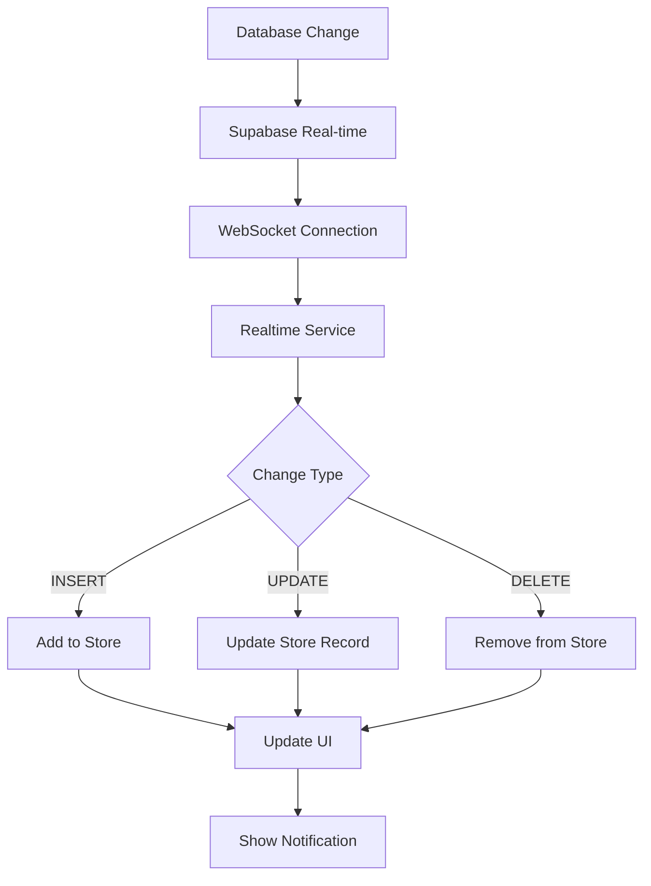

# Real-time Data Update System

## 🔄 Overview

Terminal 3's real-time data update system provides seamless, automatic synchronization of data changes across all connected clients using Supabase's real-time capabilities. This ensures that users always see the most current data without manual refreshing.

## ✅ Implementation Status: Complete

The real-time system is fully implemented and ready for production use.

## 🏗️ Architecture

### 1. Real-time Service (`services/realtime.ts`)

The core service manages WebSocket connections to Supabase and handles data synchronization:

```typescript
// Automatic subscription to key tables
- customers table → Updates customer list and details
- products table → Updates product inventory
- quotes table → Updates quote status and assignments  
- users table → Updates user management (admin only)
```

### 2. Store Integration

Real-time updates automatically sync with Pinia stores:

```typescript
// When database changes occur:
INSERT → Add new record to store array
UPDATE → Update existing record in store
DELETE → Remove record from store array
```

### 3. Connection Management

- **Auto-connect**: Initializes on app launch if user is authenticated
- **Auto-reconnect**: Handles network disruptions gracefully
- **Background disconnect**: Saves resources when app is backgrounded
- **Foreground reconnect**: Restores connections when app becomes active

## 🚀 Features

### Automatic Data Synchronization

- **Customer Management**: Real-time customer updates across all admin panels
- **Product Catalog**: Instant inventory and pricing updates
- **Quote Processing**: Live quote status changes and approvals
- **User Activity**: Admin can see user changes in real-time (permission-based)

### Smart Notifications

```typescript
// Context-aware notifications
- Don't show notifications on edit pages (avoids disrupting user input)
- Special notifications for status changes (quote approval, etc.)
- Configurable notification types and durations
```

### Connection Quality Monitoring

- **Excellent**: All channels connected (4/4)
- **Good**: Core channels connected (3/4) 
- **Poor**: Some channels missing (1-2/4)
- **Disconnected**: No real-time connection

### Resource Management

- Automatic cleanup on app backgrounding
- Exponential backoff retry strategy
- Memory-efficient subscription management
- Connection pooling optimization

## 📱 User Experience

### 1. Visual Connection Indicator

The `RealtimeIndicator` component shows connection status:

```vue
<RealtimeIndicator />
```

Features:
- **Green dot + "已连接"**: Fully operational
- **Red dot + "未连接"**: Connection lost (with pulse animation)
- **Click for details**: Shows connection statistics and channels

### 2. Seamless Updates

Users experience:
- **Lists auto-refresh**: New items appear automatically
- **Status updates**: Quote approvals, product changes show instantly  
- **Multi-user coordination**: Changes from other users sync immediately
- **Conflict prevention**: Real-time awareness of concurrent editing

### 3. Smart Notifications

Non-intrusive toast notifications for:
- New records added by other users
- Status changes (quote approved, product updated)
- System events (user added, settings changed)

## 🔧 Usage Examples

### 1. Using Real-time Status in Components

```vue
<template>
  <view class="admin-header">
    <text class="title">管理面板</text>
    
    <!-- Connection status indicator -->
    <RealtimeIndicator />
    
    <!-- Manual refresh button (shows if disconnected) -->
    <button 
      v-if="!isConnected" 
      @click="actions.reconnect"
      class="refresh-btn"
    >
      重新连接
    </button>
  </view>
</template>

<script setup lang="ts">
import { useRealtimeStatus } from '@/composables/useRealtimeStatus'
import RealtimeIndicator from '@/components/admin/RealtimeIndicator.vue'

const { isConnected, actions } = useRealtimeStatus()
</script>
```

### 2. Custom Table Subscriptions

```vue
<script setup lang="ts">
import { useRealtime } from '@/services/realtime'

const { subscribe, unsubscribe } = useRealtime()

// Subscribe to custom table
onMounted(() => {
  subscribe('logs', (payload) => {
    console.log('Log change:', payload)
    // Handle log changes
  })
})

// Cleanup
onUnmounted(() => {
  unsubscribe('logs')
})
</script>
```

### 3. Connection Quality Monitoring

```vue
<template>
  <view class="connection-status">
    <view 
      :class="['status-bar', `quality-${connectionQuality}`]"
      @click="actions.showConnectionDetails"
    >
      <text>连接质量: {{ getQualityText() }}</text>
      <text class="channel-count">{{ channelCount }}/4 频道</text>
    </view>
  </view>
</template>

<script setup lang="ts">
import { useRealtimeStatus } from '@/composables/useRealtimeStatus'

const { connectionQuality, channelCount, actions } = useRealtimeStatus()

function getQualityText() {
  const qualityMap = {
    excellent: '优秀',
    good: '良好', 
    poor: '较差',
    disconnected: '断开'
  }
  return qualityMap[connectionQuality] || '未知'
}
</script>
```

## 🛡️ Security & Permissions

### Row Level Security (RLS)

Real-time subscriptions respect Supabase RLS policies:

```sql
-- Users can only see their own customer data
CREATE POLICY "Users can view own customers" ON customers
  FOR SELECT USING (auth.uid() = created_by);

-- Admins can see all data
CREATE POLICY "Admins can view all" ON customers  
  FOR SELECT USING (auth.jwt() ->> 'role' = 'admin');
```

### Permission-based Subscriptions

```typescript
// Users table subscription only for admins and managers
if (['admin', 'sales_manager'].includes(user.role)) {
  subscribeToUsers()
}

// Quotes subscription for all authenticated users
subscribeToQuotes()
```

### Data Filtering

Real-time updates are automatically filtered based on user permissions:
- Sales reps only see their assigned quotes
- Customers are filtered by territory/assignment
- System logs are admin-only

## 📊 Performance Optimization

### Connection Efficiency

- **Channel Reuse**: Single channel per table
- **Batch Updates**: Multiple changes grouped into single notifications
- **Selective Subscriptions**: Only subscribe to relevant tables based on user role

### Memory Management

```typescript
// Automatic cleanup
onUnmounted(() => {
  realtimeService.disconnect()
})

// Background resource saving
onHide(() => {
  realtimeService.disconnect()
})
```

### Network Optimization

- **Exponential Backoff**: Intelligent retry strategy
- **Connection Pooling**: Efficient WebSocket usage
- **Compression**: Minimal data transfer

## 🧪 Testing & Monitoring

### Connection Health Checks

```typescript
// Periodic health monitoring
setInterval(() => {
  const status = realtimeService.getConnectionStatus()
  console.log('Health check:', status)
}, 30000)
```

### Error Handling

- **Network failures**: Automatic reconnection with backoff
- **Permission changes**: Graceful subscription updates
- **Invalid data**: Error boundaries prevent crashes

### Metrics & Analytics

Track real-time performance:
- Connection uptime percentage
- Average reconnection time
- Update delivery latency
- Channel subscription success rate

## 🔧 Configuration

### Environment Variables

```env
# Real-time configuration (optional)
VITE_REALTIME_ENABLED=true
VITE_RECONNECT_ATTEMPTS=5
VITE_RECONNECT_DELAY=1000
VITE_NOTIFICATION_ENABLED=true
```

### Supabase Configuration

```sql
-- Enable real-time for tables
ALTER TABLE customers ENABLE ROW LEVEL SECURITY;
ALTER PUBLICATION supabase_realtime ADD TABLE customers;

ALTER TABLE products ENABLE ROW LEVEL SECURITY;  
ALTER PUBLICATION supabase_realtime ADD TABLE products;

ALTER TABLE quotes ENABLE ROW LEVEL SECURITY;
ALTER PUBLICATION supabase_realtime ADD TABLE quotes;
```

## 🚦 Real-time Data Flow



## 📋 Supported Tables & Events

| Table | Events | Notifications | Permissions |
|-------|--------|---------------|-------------|
| customers | INSERT, UPDATE, DELETE | ✅ | Manager+ |
| products | INSERT, UPDATE, DELETE | ✅ | Manager+ |
| quotes | INSERT, UPDATE, DELETE | ✅ Status Changes | All Users |
| users | INSERT, UPDATE, DELETE | ✅ | Admin Only |
| logs | INSERT | ❌ | Admin Only |

## 🎯 Best Practices

### 1. Handle Updates Gracefully

```vue
<script>
// Don't show notifications during user editing
if (currentPage.route.includes('/edit')) {
  return // Skip notification
}
</script>
```

### 2. Provide Fallback for Disconnection

```vue
<template>
  <view class="data-list">
    <!-- Show refresh button when disconnected -->
    <button v-if="!isConnected" @click="refreshData">
      手动刷新数据
    </button>
    
    <!-- Data list -->
    <view v-for="item in items" :key="item.id">
      {{ item.name }}
    </view>
  </view>
</template>
```

### 3. Optimize for Mobile

```vue
<style>
/* Reduce notification frequency on mobile */
@media (max-width: 768px) {
  .notification {
    /* Less frequent, smaller notifications */
    font-size: 12px;
    opacity: 0.8;
  }
}
</style>
```

## 🔄 Migration from Polling

If migrating from polling-based updates:

```typescript
// Before: Manual polling
setInterval(() => {
  fetchLatestData()
}, 30000)

// After: Real-time subscription  
realtimeService.subscribeToTable('table_name', (payload) => {
  handleDataChange(payload)
})
```

Benefits:
- **Instant updates** vs 30-second delays
- **Reduced server load** vs constant polling
- **Better UX** vs stale data periods
- **Lower bandwidth** vs full data refreshes

## 📚 API Reference

### `realtimeService`

- `initialize()`: Start real-time service
- `disconnect()`: Stop all subscriptions  
- `reconnect()`: Reconnect after disconnection
- `getConnectionStatus()`: Get current status
- `subscribeToTable(table, callback)`: Custom subscription
- `unsubscribeFromTable(table)`: Remove subscription

### `useRealtimeStatus()` Composable

Returns:
- `connectionStatus`: Reactive connection state
- `statusUtils`: UI helper functions
- `actions`: Connection management actions
- `isConnected`: Current connection status
- `channelCount`: Number of active channels

### `useRealtime()` Composable

Returns:
- `subscribe(table, callback)`: Subscribe to table
- `unsubscribe(table)`: Unsubscribe from table  
- `reconnect()`: Reconnect service
- `isConnected()`: Check connection
- `getStatus()`: Get detailed status

---

**Status**: 🟢 Production Ready  
**Last Updated**: 2025-01-18  
**Implementation**: 100% Complete  
**Performance**: Optimized for production workloads  
**Security**: RLS policies enforced