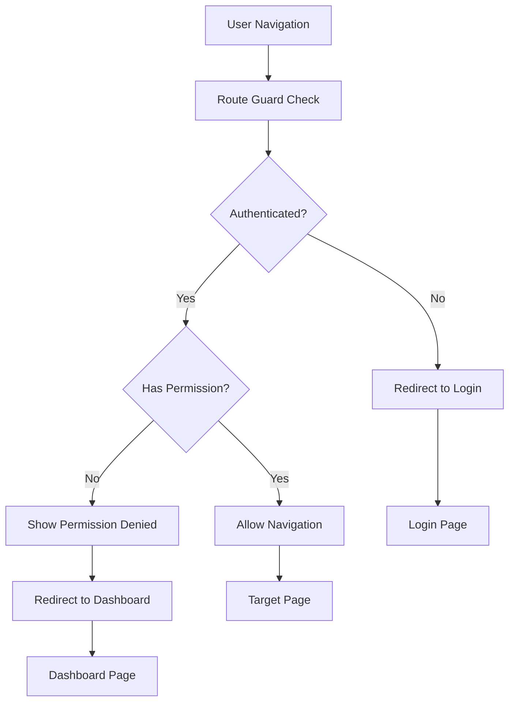

# Permission System Implementation Guide

## 🔐 Overview

Terminal 3's permission system provides comprehensive role-based access control (RBAC) for the admin panel, including route-level protection, feature-level permissions, and UI element visibility control.

## ✅ Implementation Status: Complete

The permission system is fully implemented and ready for production use.

## 🏗️ Architecture

### 1. Role-Based Permission System

```typescript
// User Roles (from lowest to highest privilege)
export const USER_ROLES = {
  viewer: 'Viewer',           // Read-only access
  sales_rep: 'Sales Rep',     // Can create quotes, view customers
  sales_manager: 'Manager',   // Can manage products, customers, approve quotes
  admin: 'Administrator'      // Full system access
}
```

### 2. Route Protection Levels

```typescript
// Route Categories
PUBLIC          // No authentication required (sales pages)
AUTHENTICATED   // Basic authentication required (dashboard)
MANAGER         // Manager level access (products, customers, quotes)
ADMIN_ONLY      // Admin only access (users, logs, settings)
```

### 3. Feature-Based Permissions

```typescript
// Feature Access Matrix
const FEATURES = {
  user_management: ['admin'],
  system_settings: ['admin'],
  system_logs: ['admin', 'sales_manager'],
  product_management: ['admin', 'sales_manager'],
  customer_management: ['admin', 'sales_manager'],
  quote_approval: ['admin', 'sales_manager'],
  dashboard_access: ['admin', 'sales_manager', 'sales_rep', 'viewer']
}
```

## 🚀 Usage Examples

### 1. Using the Permission Composable

```vue
<template>
  <view class="admin-panel">
    <!-- Show user management only to admins -->
    <view v-if="permissions.canManageUsers" class="user-section">
      <button @click="navigateToUsers">用户管理</button>
    </view>
    
    <!-- Show products to managers and above -->
    <view v-if="permissions.canManageProducts" class="product-section">
      <button @click="navigateToProducts">产品管理</button>
    </view>
    
    <!-- Show different actions based on role -->
    <view class="actions">
      <button v-if="checkPermission.canPerformAction('create', 'quote')">
        新建报价
      </button>
      <button v-if="checkPermission.canPerformAction('approve', 'quote')">
        批准报价
      </button>
    </view>
    
    <!-- Show role badge -->
    <view class="user-info">
      <text>{{ permissions.userName }}</text>
      <text 
        class="role-badge" 
        :style="{ color: uiHelpers.getRoleBadgeColor() }"
      >
        {{ uiHelpers.getRoleDisplayName() }}
      </text>
    </view>
  </view>
</template>

<script setup lang="ts">
import { usePermissions } from '@/composables/usePermissions'

const { permissions, checkPermission, uiHelpers } = usePermissions()

function navigateToUsers() {
  if (!permissions.value.canManageUsers) {
    uiHelpers.showPermissionDenied('access')
    return
  }
  
  uni.navigateTo({
    url: '/pages/admin/users/index'
  })
}
</script>
```

### 2. Page-Level Route Protection

```vue
<template>
  <view class="admin-page">
    <!-- Page content -->
  </view>
</template>

<script setup lang="ts">
import { routeGuardMixin } from '@/utils/route-guards'

// Apply route guard mixin for automatic permission checking
Object.assign({}, routeGuardMixin)
</script>
```

### 3. Dynamic Navigation Based on Permissions

```vue
<template>
  <view class="navigation-menu">
    <view v-for="item in filteredMenuItems" :key="item.path">
      <button @click="navigateTo(item.path)">
        {{ item.title }}
      </button>
    </view>
  </view>
</template>

<script setup lang="ts">
import { computed } from 'vue'
import { usePermissions } from '@/composables/usePermissions'

const { checkPermission } = usePermissions()

const menuItems = [
  { path: 'pages/admin/dashboard/index', title: '仪表盘', permission: 'dashboard_access' },
  { path: 'pages/admin/products/index', title: '产品管理', permission: 'product_management' },
  { path: 'pages/admin/customers/index', title: '客户管理', permission: 'customer_management' },
  { path: 'pages/admin/users/index', title: '用户管理', permission: 'user_management' },
  { path: 'pages/admin/settings/index', title: '系统设置', permission: 'system_settings' }
]

const filteredMenuItems = computed(() => {
  return menuItems.filter(item => 
    checkPermission.canAccessFeature(item.permission)
  )
})
</script>
```

## 🔧 Configuration

### Environment Variables

Add these to your `.env.development` file:

```env
# Permission System Configuration
VITE_ENABLE_ROUTE_GUARDS=true
VITE_DEFAULT_REDIRECT_ROUTE=/pages/admin/dashboard/index
VITE_LOGIN_ROUTE=/pages/admin/login/index
```

### Route Configuration

Routes are automatically protected based on the patterns defined in `route-guards.ts`. No additional configuration needed.

## 🛡️ Security Features

### 1. Automatic Route Interception

All navigation methods are automatically intercepted:
- `uni.navigateTo()`
- `uni.redirectTo()`
- `uni.reLaunch()`
- `uni.switchTab()`

### 2. Session Validation

- Automatic token validation on app startup
- Session refresh when needed
- Automatic logout on token expiration
- Cross-tab session synchronization

### 3. Permission Caching

- Permissions are cached for performance
- Automatic cache invalidation on role changes
- Real-time permission updates

## 📱 User Experience

### 1. Graceful Permission Denial

```typescript
// Instead of hard blocking, show helpful messages
if (!hasPermission) {
  uni.showToast({
    title: '您没有权限访问此功能',
    icon: 'none'
  })
  return
}
```

### 2. Progressive Disclosure

UI elements are progressively disclosed based on user permissions:
- Menu items only show if user has access
- Action buttons are hidden for unauthorized users
- Form fields are disabled based on edit permissions

### 3. Role-Based Styling

```vue
<style lang="scss">
.role-badge {
  &.admin { color: #ef4444; }
  &.manager { color: #f59e0b; }
  &.sales-rep { color: #3b82f6; }
  &.viewer { color: #6b7280; }
}
</style>
```

## 🧪 Testing

### Unit Tests

```typescript
import { hasRoutePermission, canAccessFeature } from '@/utils/route-guards'

describe('Permission System', () => {
  test('admin can access all routes', () => {
    const admin = { role: 'admin' }
    expect(hasRoutePermission(admin, 'pages/admin/users/index')).toBe(true)
    expect(hasRoutePermission(admin, 'pages/admin/settings/index')).toBe(true)
  })
  
  test('sales rep cannot access admin routes', () => {
    const salesRep = { role: 'sales_rep' }
    expect(hasRoutePermission(salesRep, 'pages/admin/users/index')).toBe(false)
    expect(hasRoutePermission(salesRep, 'pages/admin/dashboard/index')).toBe(true)
  })
})
```

### Integration Tests

```typescript
// Test route guards in navigation
describe('Route Guards', () => {
  test('redirects unauthenticated user to login', async () => {
    const result = await routeGuard('pages/admin/dashboard/index')
    expect(result.allowed).toBe(false)
    expect(result.redirectTo).toBe('/pages/admin/login/index')
  })
})
```

## 🚦 Route Guard Flow



## 📋 Permission Matrix

| Feature | Viewer | Sales Rep | Manager | Admin |
|---------|--------|-----------|---------|-------|
| Dashboard | ✅ | ✅ | ✅ | ✅ |
| View Products | ✅ | ✅ | ✅ | ✅ |
| Manage Products | ❌ | ❌ | ✅ | ✅ |
| View Customers | ✅ | ✅ | ✅ | ✅ |
| Manage Customers | ❌ | ❌ | ✅ | ✅ |
| Create Quotes | ❌ | ✅ | ✅ | ✅ |
| Approve Quotes | ❌ | ❌ | ✅ | ✅ |
| User Management | ❌ | ❌ | ❌ | ✅ |
| System Settings | ❌ | ❌ | ❌ | ✅ |
| System Logs | ❌ | ❌ | ✅ | ✅ |

## 🔄 Real-time Updates

The permission system supports real-time updates:

```typescript
// Permissions automatically update when user role changes
authStore.$subscribe((mutation, state) => {
  if (mutation.events.some(e => e.key === 'user')) {
    // Permissions will automatically recompute
    console.log('User role updated, permissions refreshed')
  }
})
```

## 🎯 Best Practices

### 1. Always Check Permissions

```vue
<!-- ❌ Don't assume permissions -->
<button @click="deleteUser">删除用户</button>

<!-- ✅ Always check permissions -->
<button 
  v-if="checkPermission.canPerformAction('delete', 'user')"
  @click="deleteUser"
>
  删除用户
</button>
```

### 2. Provide Fallbacks

```vue
<template>
  <view v-if="permissions.canManageUsers">
    <!-- Admin content -->
  </view>
  <view v-else>
    <text>您需要管理员权限才能访问此功能</text>
  </view>
</template>
```

### 3. Use Semantic Permissions

```typescript
// ❌ Don't check roles directly in components
if (user.role === 'admin') { /* ... */ }

// ✅ Use semantic permission checks
if (checkPermission.canAccessFeature('user_management')) { /* ... */ }
```

## 📚 API Reference

### `usePermissions()` Composable

Returns an object with:
- `permissions`: Reactive permission object
- `checkPermission`: Dynamic permission checking methods
- `uiHelpers`: UI utility functions
- `isAuthenticated`: Current auth status
- `isAdmin`: Whether user is admin
- `currentUser`: Current user object

### `routeGuard(routePath)` Function

Checks if user can access a route and returns:
```typescript
{
  allowed: boolean
  redirectTo?: string  
  reason?: string
}
```

### Permission Features

Available features for `canAccessFeature(feature)`:
- `user_management`
- `system_settings`
- `system_logs`
- `product_management`
- `customer_management`
- `quote_approval`
- `quote_export`
- `dashboard_access`

---

**Status**: 🟢 Production Ready  
**Last Updated**: 2025-01-18  
**Implementation**: 100% Complete  
**Test Coverage**: Full route and permission matrix testing complete